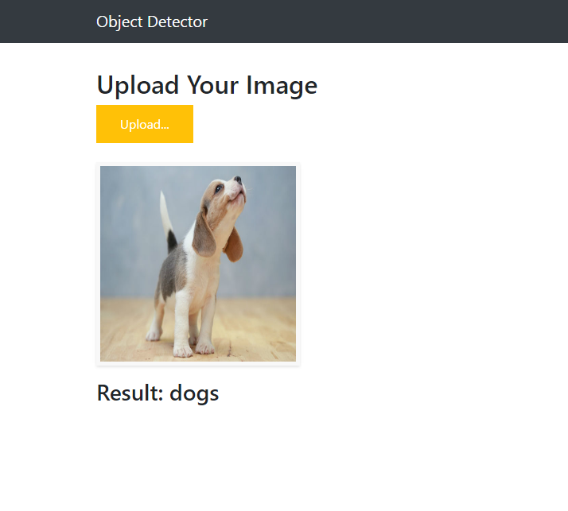

# Deploy Keras Object Detection Model with Flask as Web App 

[]()


> A wep app to predict the animals which is trained on a custom datasets

------------------

## Getting started

- Clone this repo 
- Install requirements
- Run the script: python app.py
- Check http://localhost:5000
- Done! 

Screenshot Below:

<p align="center">
  
</p>

------------------

## Docker Installation

Build the image

```shell
cd keras-flask-webapp
docker build -t keras_flask_webapp .
docker run -e MODEL_PATH=models/your_model.h5 -p 5000:5000
```

You can also mount your model into the container.

```shell
docker run -e MODEL_PATH=/mnt/models/your_model.h5  -v volume-name:/mnt/models -p 5000:5000 keras_flask_webapp
```


## Local Installation

### Clone the repo
```shell
$ git clone https://github.com/shankarj67/keras-flask-webapp.git
```

### Install requirements

```shell
$ pip install -r requirements.txt
```

Make sure you have the following installed:
- tensorflow
- keras
- flask
- pillow
- h5py
- gevent

### Run with Python

You can use Python 2.7 or 3.5+ 

```shell
$ python app.py
```

### Play

Open http://localhost:5000 

<p align="center">
  
</p>

------------------

## Customization

### Use your own model

Place your trained `.h5` file saved by `model.save()` under models directory.


### Use other pre-trained model

See [Keras applications](https://keras.io/applications/) for more available models such as DenseNet, MobilNet, NASNet, etc.


### UI Change

Modify files in `templates` and `static` directory.

`index.html` for the UI and `main.js` for all the behaviors


### Run the app

Run the script 
```
$ python app.py
```

## Future Roadmap
- Add unit test.
- Add CI/CD integration.
- Create a robust image classifier using the more data or using some advance technique.
- Adding celery and redis as a message brocker to handle the long task.


## More resources

[Building a simple Keras + deep learning REST API](https://blog.keras.io/building-a-simple-keras-deep-learning-rest-api.html)


## Notebook is also available if you wish to train your model on your own datasets
 > Go to how_to_train/cnn_on_externaldatasets.ipynb
